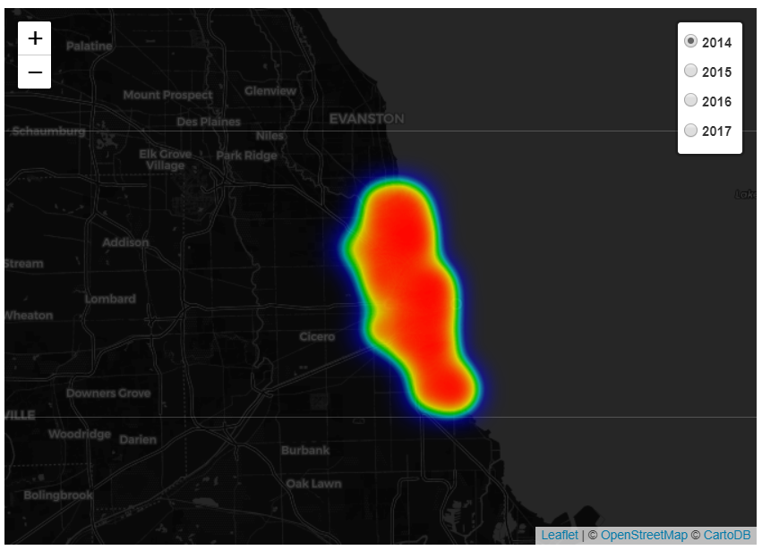
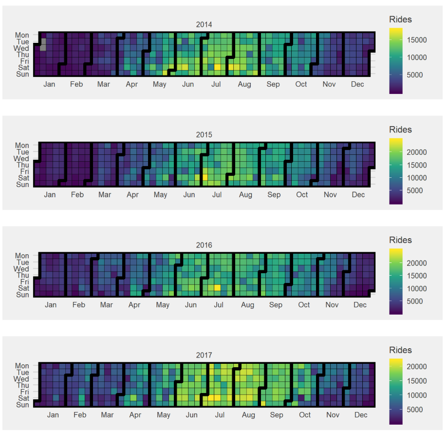
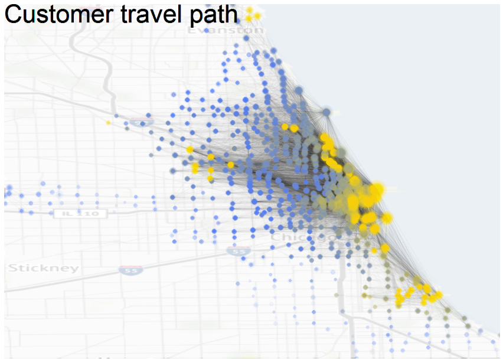
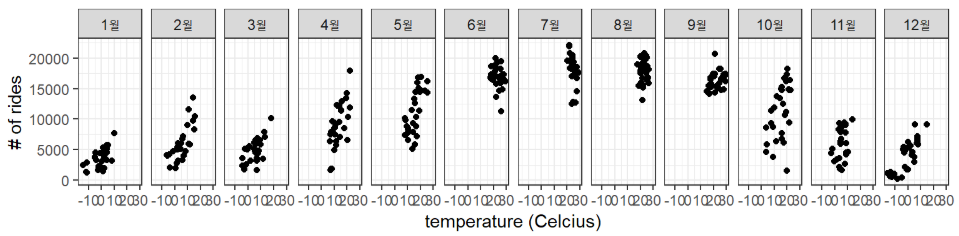

## [Divvy](https://www.divvybikes.com/)  

### [Download Data](https://www.divvybikes.com/system-data)  
* Historical trip data available to the public
* The Data
    + Each trip is anonymized and includes :
        + Trip start day and time
        + Trip end day and time
        + Trip start station
        + Trip end station
        + Rider type (Member, Single Ride, Explore Pass)
        + If a Member trip, it will also include Member's gender and year of birth  
        
### Divvy_EDA
* Exploratory Data Analysis of Divvy data
    + Histogram
    + Density plot

### Divvy_heatmap_calendarheatmap
* Display heatmap of start station in the years 2014-2017
  

* Display calendar heatmap of the years 2014-2017
  

### Divvy_popular_destinations
* Mark popular destinations on the map

* Draw circle plot using `ChordDiagram`
* Analyze characteristics of users at midnight to dawn
* Merge `weather.csv` data to see the relationship between weather and the number of rides

